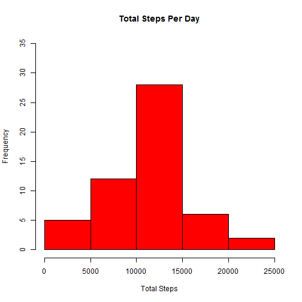
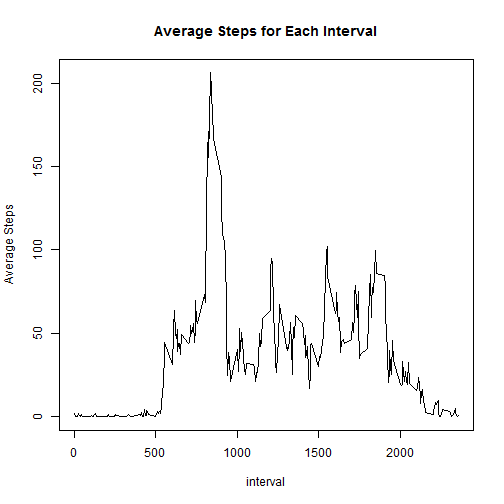
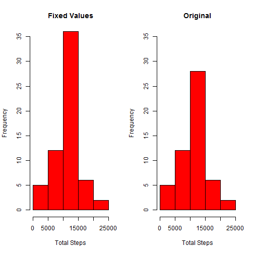
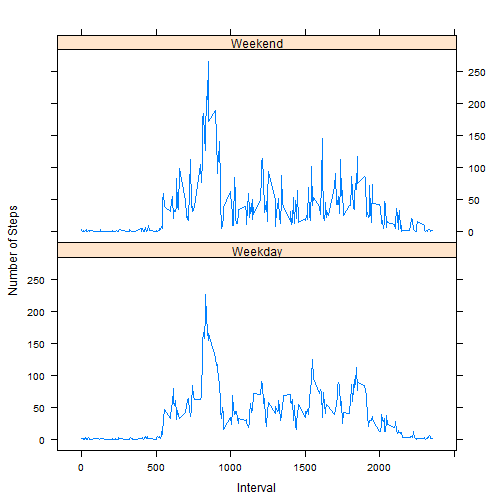

##Introduction  
This report details all the code and results necessary to fulfill Assessment 1 of the Reproducible Research Course.  

#Assignment  
  
##Loading and preprocessing the data  
###Loading  
First set your working directory or copy the data set to be loaded into your working directory.  
The file can be loaded simply by running read.csv():

```r
setwd("D:/My Documents/Documents/Coursera/Reproducible Research")
activity<-read.csv("activity.csv")
```

###Preprocessing  
Any data processing required is performed in the relevant section of the assignment. There is no preprocessing required.

This Assessment uses a couple of external librarys:  
1. dplyr - used for data manipulation  
2. lattice - A plotting system used for some of the graphics  


```r
library(dplyr)
library(lattice)
```

## What is the mean number of steps taken per day?  
###1. Calculate the total number of steps taken per day  
First the data needs to be grouped and summarised using dplyr

```r
activity.total.steps <- activity %>% group_by(date) %>% summarise(steps.total = sum(steps))
```

###2. Make a histogram of the total number of steps taken each day  
Now a histogram can be generated showing the spread of mean values  

```r
hist(activity.total.steps$steps.total, ylim = c(0, 35), col = "red", xlab = "Total Steps", 
    main = "Total Steps Per Day")
```

 

###3. Calculate and report the mean and median of the total number of steps taken per day 
The mean and median are calculated with the following code:  

```r
activity.mean.median <- activity.total.steps %>% summarise(steps.mean = mean(steps.total, 
    na.rm = TRUE), steps.median = median(steps.total, na.rm = TRUE), steps.sd = sd(steps.total, 
    na.rm = TRUE))
```

Which results in:  
Mean = 10766.19  
Median = 10765


##What is the average daily activity pattern
###1. Make a time series plot (i.e. type = "l") of the 5-minute interval (x-axis) and the average number of steps taken, averaged across all days (y-axis)  
Group by interval, summarise to get the average (mean) number of steps per interval

```r
activity.interval.steps <- activity %>% group_by(interval) %>% summarise(steps.average = mean(steps, 
    na.rm = TRUE))
```

Now plot  

```r
plot(activity.interval.steps$interval, activity.interval.steps$steps.average, 
    type = "l", main = "Average Steps for Each Interval", xlab = "interval", 
    ylab = "Average Steps")
```

 

###2. Which 5-minute interval, on average across all the days in the dataset, contains the maximum number of steps?  
To find which 5 minute interval has the maximum average number of steps

```r
activity.max.average.steps <- activity.interval.steps %>% summarise(steps.average.max = max(steps.average))
activity.interval.max <- activity.interval.steps %>% filter(steps.average == 
    activity.max.average.steps$steps.average.max)
```
Which results in:  
Interval Number 835  


## Imputting missing values

###1. Which 5-minute interval, on average across all the days in the dataset, contains the maximum number of steps?  

```r
activity.na.count <- activity %>% filter(is.na(steps)) %>% summarise(count = n())
```
  
Number of NAs 2304    
  
###2. Devise a strategy for filling in all of the missing values in the dataset    
The strategy I've used is similar to that suggested in the course material, i.e. calculate the averages for all the intervals 
and then use that dataset to fill in the blanks.
To do this the following method was used:  
1. Generate a dataset with no NA steps  
2. Generate a second dataset which contains all the NA values  
3. Generate a dataset which contains the average number of steps for each interval  
4. Join the NA steps dataset to the interval averages using the interval column  
5. Append the dataset created in step 4 to the dataset created in step 1.  

###3. Create a new dataset that is equal to the original dataset but with the missing data filled in.  

```r
# 1. Has Steps
activity.has.steps <- activity %>% filter(!is.na(steps))
# 2. No Steps
activity.no.steps <- activity %>% filter(is.na(steps))
# 3. mean for each interval
activity.mean.steps <- activity %>% filter(!is.na(steps)) %>% group_by(interval) %>% 
    summarise(steps.mean = mean(steps))
# 4. join no steps and mean steps by interval
activity.fixed.na.steps <- inner_join(activity.no.steps, activity.mean.steps, 
    by = "interval") %>% select(steps = steps.mean, date, interval)
# 5. append fixed_na_steps to has_steps
activity.fixed <- bind_rows(activity.has.steps, activity.fixed.na.steps)
```

### 4. Make a histogram of the total number of steps taken each day and Calculate and report the mean and median total number of steps taken per day.  
The new steps per day is calculated as  

```r
activity.total.steps.na.fixed <- activity.fixed %>% group_by(date) %>% summarise(steps.total = sum(steps))
```

and shown as  

```r
par(mfrow = c(1, 2))
hist(activity.total.steps.na.fixed$steps.total, col = "red", xlab = "Total Steps", 
    main = "Fixed Values", ylim = c(0, 35))
hist(activity.total.steps$steps.total, col = "red", xlab = "Total Steps", main = "Original", 
    ylim = c(0, 35))
```

 

```r
par(mfrow = c(1, 1))
```


The new mean and median values are as follows:


```r
activity.fixed.na.mean.median <- activity.total.steps.na.fixed %>% summarise(steps.mean = mean(steps.total, 
    na.rm = TRUE), steps.median = median(steps.total, na.rm = TRUE), steps.sd = sd(steps.total, 
    na.rm = TRUE))
```


Mean = 10766.19  
Median = 10766.19  
compared to the old values of  
Mean = 10766.19  
Median = 10765  
  
So although the distribution of values has clearly changed slightly, the mean and median are the same. Mathematically this shouldn't be a suprise given that the average number of steps per interval was used to imput the missing values.  
*If you take a set of numbers, calculate the average, add the average number as a new value in the set then calculate the average again, you will get the answer as before*

A good test here would be to have a look at the standard deviation, we'd expect it to decrease to reflect the reduced spread of the fixed dataset
  
Old Standard Deviation = 4269.18  
New Standard Deviation = 3974.39


##Are there differences in activity patterns between weekdays and weekends?  
###1. Create a new factor variable in the dataset with two levels - "weekday" and "weekend" indicating whether a given date is a weekday or weekend day.  
First - create a Weekday variable in the fixed dataset which indicates if the data point was gathered on a weekday or weekend:  

```r
activity.fixed$weekday <- sapply(weekdays(strptime(activity.total.steps.na.fixed$date, 
    "%Y-%m-%d")), switch, Monday = "Weekday", Tuesday = "Weekday", Wednesday = "Weekday", 
    Thursday = "Weekday", Friday = "Weekday", Saturday = "Weekend", Sunday = "Weekend")
```

  
Now summarise the data by interval and the new weekday variable  

```r
activity.interval.steps.na.fixed <- activity.fixed %>% group_by(interval, weekday) %>% 
    summarise(steps.average = mean(steps, na.rm = TRUE))
```

###2. Make a panel plot containing a time series plot (i.e. type = "l") of the 5-minute interval (x-axis) and the average number of steps taken  
Finally, plot the averages by interval to compare the difference of weekdays vs weekends:  

```r
xyplot(steps.average ~ interval | weekday, data = activity.interval.steps.na.fixed, 
    layout = c(1, 2), type = "l", xlab = "Interval", ylab = "Number of Steps")
```

 
